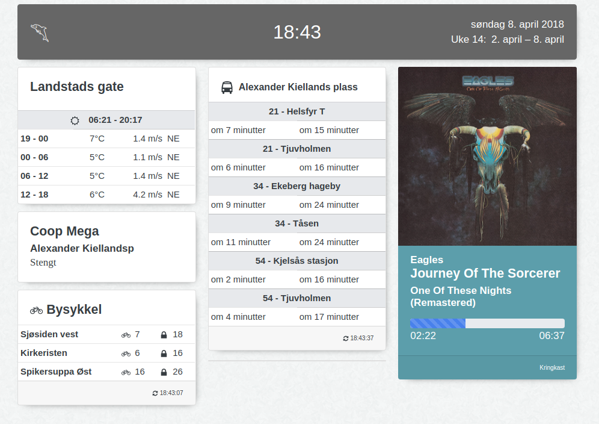

# Infoscreen with useful things

## How to use
* Run a browser with CORS protection disabled, e.g. `chromium-browser --disable-web-security --user-data-dir --test-type --kiosk --incognito`.
  * Disabling CORS protextion lets the webpage make API requests to other sites, so that you don't need to run a http server yourself.
  * Don't use the unsafe browser for your regular browsing.
* `yarn install`
* `BROWSER=chromium-browser yarn start`
* Look at the JS console in the browser for help with `.env`

### Kioskifying
- https://github.com/abbott567/raspberry-pi-kiosk has a good guide

#### Oof ouch owie my eyes
- https://github.com/linusg/rpi-backlight Controlling RPi display backlight
